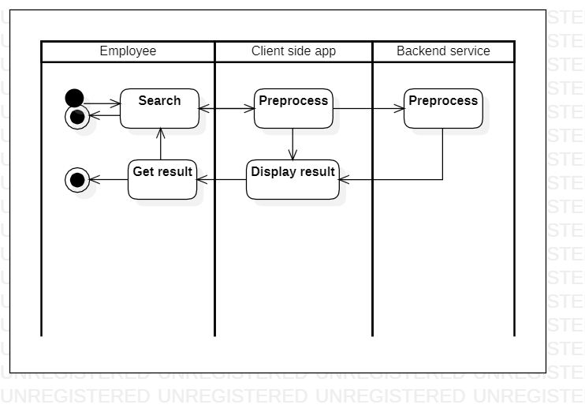

# organizationalstructure

[English](organizationalstructure.md) | [Русский](organizationalstructure.ru.md)

Name: **Organizational structure**.

The scenario also involves using the management app to search for employees based on various criteria, such as name, department, or location. 
This allows managers to quickly find and communicate with the right employees for specific tasks or projects.

Process pattern: [information](../../processpatterns/information.md)

Responsible modules: [backend service](../../backend/systembackend.md)

## Process description

### Step-by-step execution

- The app displays a search bar where the manager can input employee names, job titles, or other relevant keywords.
- The app returns a list of employees that match the search criteria.
- The manager can view employee profiles, including contact information, job history, and performance metrics.
- The manager can use this information to make informed decisions about scheduling, promotions, or disciplinary actions.

