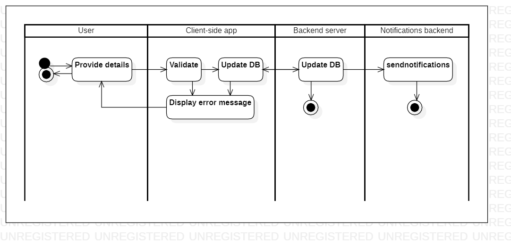

# reportincident 

[English](reportincident.md) | [Русский](reportincident.ru.md)

Наименование: **Сообщить об инциденте**.

Сценарий, отвечающий за сообщение об инциденте курьерами, предполагает предоставление пользователям механизма сообщения об угрозах безопасности, авариях или других инцидентах.
Это можно сделать через мобильное приложение или веб-интерфейс, который позволяет курьерам отправлять отчеты о происшествиях с соответствующими подробностями.

Паттерн процесса: [requesting](../../processpatterns/requesting.ru.md)

Ответственные модули: [бэкенд-сервис](../../backend/systembackend.ru.md)

## Зависимости

### Влияет на

| Бэкэнд-сервис | Процесс |
| --- | ---- |
| [notificationsbackend](../../backend/notificationsbackend.ru.md) | [sendnotifications](../notificationsbackend/sendnotifications.ru.md) |

## Описание процесса

Общее описание сценария уведомления об инцидентах в курьерской службе заключается в том, что он позволяет пользователям сообщать о любых инцидентах:
- процесс доставки: несчастные случаи, кражи или повреждения товара;
- склад: аварии, неисправности оборудования или кражи.

Интерактивные шаги в сценарии включают выбор типа инцидента, описание того, что произошло, и отправку отчета об инциденте.

### Пошаговое выполнение

- Пользователь открывает приложение.
- Пользователь выбирает опцию «Сообщить об инциденте».
- Система предлагает сотруднику предоставить подробную информацию о происшествии.
- Сотрудник сообщает подробности происшествия.
     - Выберите тип произошедшего происшествия (авария, неисправность оборудования, повреждение продукта, кража или другое).
     - Предоставьте текстовое описание того, что произошло.
     - Отправьте отчет о происшествии, чтобы уведомить руководство и других сотрудников о происшествии.
- Система сохраняет отчет об инциденте в базе данных.
- Система отправляет уведомление менеджеру о происшествии.

