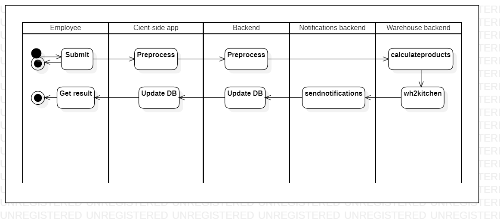

# requestequipment

[English](requestequipment.md) | [Русский](requestequipment.ru.md)

Name: **Request equipment**.

The request inventory and equipment scenario in the delivery service app involves allowing kitchen employees to request additional inventory or equipment as needed to fulfill incoming orders. 
The app sends these requests to the warehouse or other relevant departments for fulfillment.

Process pattern: [requesting](../../processpatterns/requesting.md)

Responsible modules: [client application](../../frontend/kitchenclient.md), [backend service](../../backend/kitchenbackend.md)

Platform version: v0.1

## Dependencies

### Influences on

| Backend service | Process |
| --- | ---- |
| [notificationsbackend](../../backend/notificationsbackend.md) | [sendnotifications](../notificationsbackend/sendnotifications.md) |
| [warehousebackend](../../backend/warehousebackend.md) | [calculateproducts](../warehouse/calculateproducts.md) |
| [warehousebackend](../../backend/warehousebackend.md) | [wh2kitchen](../warehouse/wh2kitchen.md) |

## Process description

### Step-by-step execution plan of the process

- A kitchen employee notices that a piece of equipment is broken or malfunctioning.
- The employee opens the delivery service app and navigates to the backend service for kitchen.
- The employee selects the option to request new equipment.
- The employee fills out a form with details about the broken equipment and submits the request.
- The system checks if the inventory or equipment is available in the warehouse.
- If it is available, the system sends a notification to the warehouse employee to prepare it for delivery.
- If it is not available, the system sends a notification to the manager to order it.
- The request is received by the manager, who reviews it and approves or denies the request.
- If approved, the manager orders the new equipment and updates the employee on when it will arrive.

## Data structures

| Object | DTO | Database table |
| --- | ---- | --- |
| EquipmentRequest | EquipmentRequestDTO | - |
| [Employee](https://github.com/alexeysp11/workflow-lib/blob/main/src/Models/Business/InformationSystem/Employee.cs) | EmployeeDTO | - |
