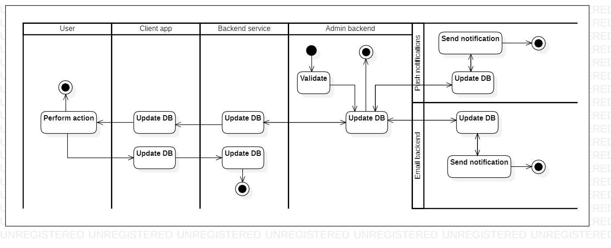

# calculateproducts

[English](calculateproducts.md) | [Русский](calculateproducts.ru.md)

Наименование: **Пересчитать продукты**.

Сценарий, отвечающий за расчет продуктов, хранящихся на складе сотрудниками склада компании, занимающейся доставкой, предполагает использование программного обеспечения для управления запасами для отслеживания входящих поставок, исходящих заказов и текущего уровня запасов.
Это позволяет сотрудникам склада точно рассчитывать, какое количество каждого товара доступно в любой момент времени, и принимать обоснованные решения о заказе и пополнении запасов.

Паттерн процесса: [maintenance](../../processpatterns/maintenance.ru.md)

Ответственные модули: [клиентское приложение](../../frontend/warehouseclient.md), [бэкенд-сервис](../../backend/warehousebackend.md)

Версия платформы: v0.1

## Зависимости

### Зависит от

| Бэкэнд-сервис | Процесс |
| --- | ---- |
| [adminbackend](../../backend/adminbackend.ru.md) | |

### Влияет на

| Бэкэнд-сервис | Процесс |
| --- | ---- |
| [notificationsbackend](../../backend/notificationsbackend.ru.md) | [sendnotifications](../notificationsbackend/sendnotifications.ru.md) |

## Описание процесса

Общее описание сценария расчета количества продуктов в серверной службе склада заключается в том, что он позволяет персоналу склада отслеживать уровень запасов и обеспечивать наличие достаточного количества товара на складе для выполнения заказов.

Интерактивные шаги в рамках сценария включают сканирование штрих-кодов продуктов, ввод количества продуктов и обновление записей о запасах.

### План пошагового выполнения процесса

- Сотрудник склада открывает приложение.
- Сотрудник выбирает продукт, который хочет рассчитать.
- Система проверяет базу данных запасов для этого продукта.
- Система отображает сотруднику текущий запас этого продукта.
- Сканировать штрих-коды продуктов, чтобы идентифицировать продукты на складе.
- Введите количество каждого товара на руках
- Обновить инвентарные записи, чтобы отразить количество новых продуктов.

