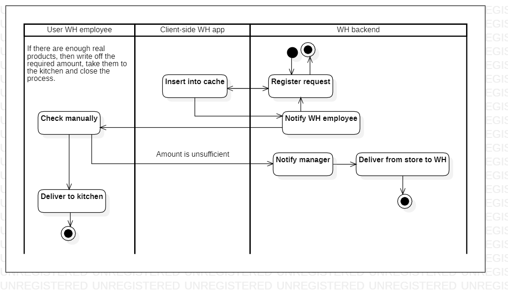

# warehouse.fromwhtokitchen

Read this in other languages: [English](fromwhtokitchen.md), [Russian/Русский](fromwhtokitchen.ru.md). 

Warehouse client application: Deliver from WH to kitchen

The description of the **client application** is presented at [this link](../../frontend/warehouseclient.md).

### Step-by-step execution

- The warehouse receives a notification:
    - List of required starting products and their quantity/weight/volume.
- A manual check is carried out to ensure that the quantity/weight/volume of the required starting products corresponds to their actual quantity/weight/volume.
- If there are not enough real products, then the warehouse employee must fix this in the application (the database is updated) and start the [Deliver from store to warehouse](../courier/store2wh.md) process.
    - Also at this stage, the manager is notified (since this is a planning / accounting collision of products)
- If there are enough real products, then write off the required amount, take them to the kitchen and close the process.

