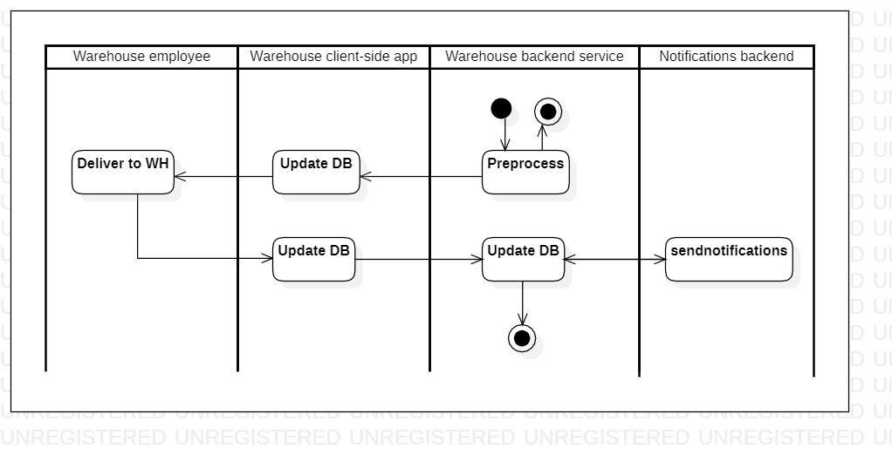

# kitchen2wh

[English](kitchen2wh.md) | [Русский](kitchen2wh.ru.md)

Name: **Deliver from kitchen to WH**.

The scenario for the delivery of products and ingredients from the kitchen to the warehouse by warehouse employees in a delivery service company involves filling out an application for the transportation of finished products, as well as excess or unused ingredients, from the kitchen to the warehouse as part of the process of preparing an order from the client.

Process pattern: [delivering](../../processpatterns/delivering.md)

Responsible modules: [client application](../../frontend/warehouseclient.md), [backend service](../../backend/warehousebackend.md)

Platform version: v0.1

## Dependencies

### Influences on

| Backend service | Process |
| --- | ---- |
| [notificationsbackend](../../backend/notificationsbackend.md) | [sendnotifications](../notificationsbackend/sendnotifications.md) |

## Process description

### Step-by-step execution

- The kitchen staff prepared the order.
- The kitchen employee opens the application.
- The kitchen employee selects the order within which the cooking took place.
- The kitchen employee indicates that the order is ready to be transported to the warehouse.
- Additionally, the kitchen employee can indicate the quantity and weight of excess or unused ingredients.
- The request is sent to the warehouse backend service.
- The system notifies the warehouse employee that the order can be picked up. A notification can also be sent to the client that the order is ready and will soon be sent for delivery.
- A warehouse employee goes to the kitchen, picks up food and takes it to the warehouse.
- The warehouse employee notes that the process is completed.

## Data structures

| Object | DTO | Database table |
| --- | ---- | --- |
| [Product](https://github.com/alexeysp11/workflow-lib/blob/main/src/Models/Business/Products/Product.cs) | ProductDTO | - |
| [Ingredient](https://github.com/alexeysp11/workflow-lib/blob/main/src/Models/Business/Products/Ingredient.cs) | IngredientDTO | - |
| [Warehouse](https://github.com/alexeysp11/workflow-lib/blob/main/src/Models/Business/InformationSystem/Warehouse.cs) | WarehouseDTO | - |
| Kitchen | KitchenDTO | - |
| [Employee](https://github.com/alexeysp11/workflow-lib/blob/main/src/Models/Business/InformationSystem/Employee.cs) | EmployeeDTO | - |

- The kitchen object could have properties such as name, location, capacity, and equipment. It could also have methods for adding or removing equipment, scheduling staff, and managing inventory.
The Kitchen object in the delivery service app may have properties such as kitchenID, kitchenName, kitchenStaff, inventory, and orderQueue. Methods for this object could include requestIngredient, updateInventory, and processOrder.
