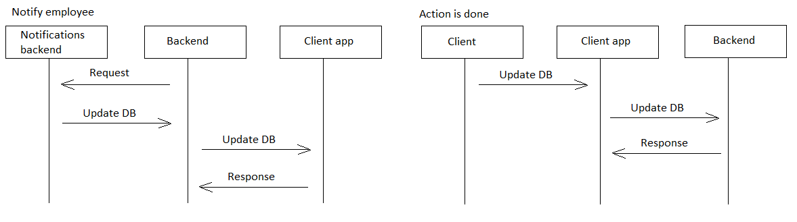
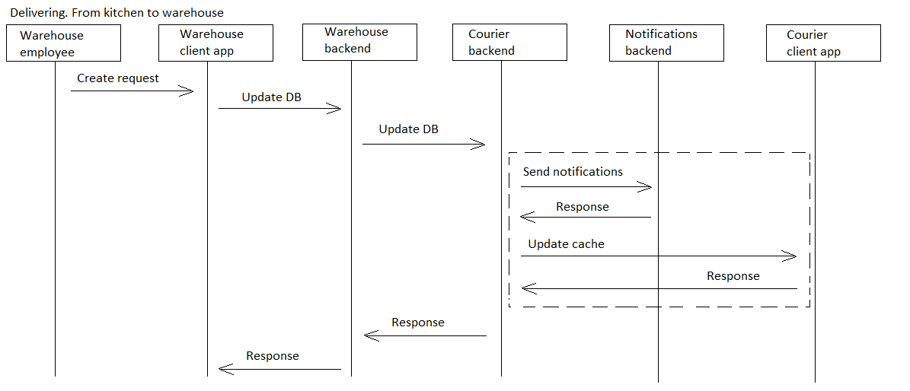

# kitchen2wh

[English](kitchen2wh.md) | [Русский](kitchen2wh.ru.md)

Наименование: **Доставить с кухни на WH**.

Сценарий доставки продуктов и ингредиентов с кухни на склад сотрудниками склада в компании службы доставки предполагает оформление заявки на трансопртировку готовой продукции, а также лишних или неиспользованных ингредиентов, из кухни на склад в рамках процесса подготовки заказа от клиента.

Паттерн процесса: [delivering](../../processpatterns/delivering.ru.md)

Ответственные модули: [клиентское приложение](../../frontend/warehouseclient.md), [бэкенд-сервис](../../backend/warehousebackend.md)

Версия платформы: v0.1

## Зависимости

### Влияет на

| Бэкэнд-сервис | Процесс |
| --- | ---- |
| [notificationsbackend](../../backend/notificationsbackend.ru.md) | [sendnotifications](../notificationsbackend/sendnotifications.ru.md) |

## Описание процесса

### Flowchart-диаграммы для сетевого взаимодействия

### План пошагового выполнения процесса

- Сотрудники кухни приготовли заказ.
- Сотрудник кухни открывает приложение.
- Сотрудник кухни выбирает заказ, в рамках которого происходила готовка.
- Сотрудник кухни указывает, что заказ готов к транспортировке на склад.
- Дополнительно сотрудник кухни может указать количество и вес лишних или неиспользованных ингредиентов.
- Запрос отправляется на бэкенд-сервис склада.
- Система уведомляет сотрудника склада о том, что заказ можно забирать. Также уведомление может быть отправлено клиенту о том, что заказ уже готов и скоро будет отправлен в доставку.
- Сотрудник склада идёт на кухню, забирает продукты и относит на склад.
- Сотрудник склада отмечает, что процесс выполнен.

### Диаграммы последовательности

