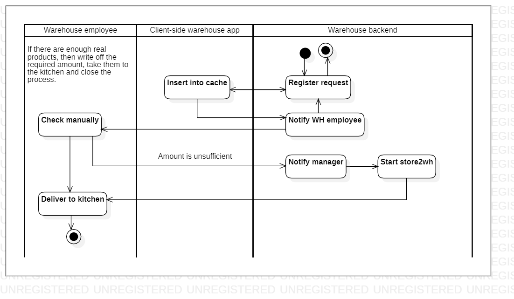

# wh2kitchen

[English](wh2kitchen.md) | [Русский](wh2kitchen.ru.md)

Name: **Deliver from WH to kitchen**.

The scenario responsible for delivering ingredients from the warehouse to the kitchen by warehouse employees in the delivery service company involves receiving requests from the kitchen staff for specific ingredients, locating those ingredients in the warehouse, packaging them for transport, and delivering them to the kitchen in a timely manner.

Process pattern: [delivering](../../processpatterns/delivering.md)

Responsible modules: [client application](../../frontend/warehouseclient.md), [backend service](../../backend/warehousebackend.md)

## Dependencies

### Depends on

| Backend service | Process |
| --- | ---- |
| [customerbackend](../../backend/customerbackend.md) | [preprocessorder](../../processes/customer/preprocessorder.md) |

### Influences on

| Backend service | Process |
| --- | ---- |
| [notificationsbackend](../../backend/notificationsbackend.md) | [sendnotifications](../../processes/notificationsbackend/sendnotifications.md) | 
| [courierbackend](../../backend/courierbackend.md) | [store2wh](../courier/store2wh.md) |

## Process description

The overall description of the scenario for delivery from the warehouse to the kitchen in the warehouse backend service is that it allows warehouse staff to manage the flow of products from storage to production. 

The interactive steps within the scenario include receiving delivery requests from the kitchen, selecting products for delivery, preparing products for transport, and updating delivery status.

### Step-by-step execution

- The warehouse receives a notification:
    - List of required starting products and their quantity/weight/volume.
- A manual check is carried out to ensure that the quantity/weight/volume of the required starting products corresponds to their actual quantity/weight/volume.
- If there are not enough real products, then the warehouse employee must fix this in the application (the database is updated) and start the [Deliver from store to warehouse](../courier/store2wh.md) process.
    - Also at this stage, the manager is notified (since this is a planning / accounting collision of products)
- If there are enough real products, then write off the required amount, take them to the kitchen and close the process.

- Receive delivery requests from the kitchen
- Select the products needed for the delivery
- Prepare the products for transport, such as packing them into boxes or crates
- Update delivery status to indicate that the products have been picked up and are en route to the kitchen

## Data structures

| Object | DTO | Database table |
| --- | ---- | --- |
| [Product](https://github.com/alexeysp11/workflow-lib/blob/main/src/Models/Business/Products/Product.cs) | ProductDTO | - |
| [Ingredient](https://github.com/alexeysp11/workflow-lib/blob/main/src/Models/Business/Products/Ingredient.cs) | IngredientDTO | - |
| [Warehouse](https://github.com/alexeysp11/workflow-lib/blob/main/src/Models/Business/InformationSystem/Warehouse.cs) | WarehouseDTO | - |
| Kitchen | KitchenDTO | - |
| [Employee](https://github.com/alexeysp11/workflow-lib/blob/main/src/Models/Business/InformationSystem/Employee.cs) | EmployeeDTO | - |
