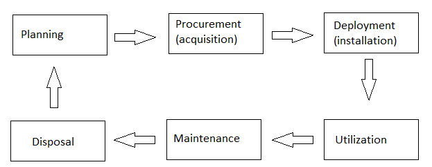

# requesting

[English](requesting.md) | [Русский](requesting.ru.md)

Наименование: **Запрос**.

`requesting` - это паттерн реализации бизнес-процессов, которые связаны с запросом на выполнение некоторого действия в рамках компетенций и должностных обязанностей сотрудников компании (например, запрос ингридиентов или оборудования, изменение меню/рецептов, а также уведомление об инциденте). 

Это паттерн реализации бизнес-процессов, которые связаны с изменением параметров или настроек, которые влияют на работу компании в целом, на выполнение бизнес-процессов или на структуру организации. 
Такие процессы используются такими сервисами как [adminbackend](../backend/adminbackend.ru.md) или [managerbackend](../backend/managerbackend.ru.md). 

Это паттерн реализации бизнес-процессов, которые связаны с выполнением поручения от руководства или реализации функционала. 

Жизненный цикл оборудования:

